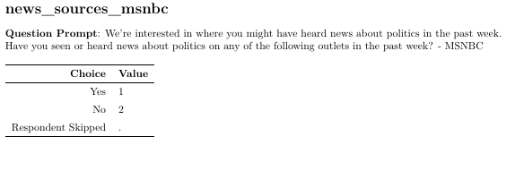

```{r setup, include=FALSE}
knitr::opts_chunk$set(echo = TRUE)
library(haven)
library(readr)
library(dplyr)
library(ggplot2)
```

```{=tex}
\begin{centering}
{\bf Abstract}
Statisticians, political scientists, sociologists and economist have studied the relationship between socioeconomic status and political leaning since these professions first began. This paper delves even deeper, and tries to show how socioeconomic status,political leaning and source of political and economic news influence the level of trust in both government and society.

\end{centering}
```
# Introduction


The R language [@R-base] is used, in addition to a variety of packages and scholarly sources. Please refer to the Bibliography section or the "references.bib" file in the Git repository for more information. The dataset from [@IIDEA2021] is used. The [@R-bibtex] package is used to assist in citing external resources. The relationship in question can be summarized as one between household income, federal political party affiliation, trust in government and society and source of political news. Further stratification based on age is done to observe whether socioeconomic status has changed among different age groups. This post-stratification was collected by [@IPUMS].


# Data before Stratification

## Obtaining the Data

The [@IIDEA2021] dataset includes multiple compressed folders. All of them have been extract in the data subdirectory of the inputs folder. Within this, exists a folder for the data in the Stata file format, which further contains subdirectories which contain the data and relevant utility files for specific time periods, primarily divided into 3 phases. Each phase has subdirectories for various time periods. However, in the parent folder with the directories for all the phases, a directory which includes all the parallel studies exists. Only the parallel surveys will be used for the purposes of this paper since they were are conducted concurrently, so we can eliminate any speculation that can be attributed to differences regarding time-specific situations. The [@R-ggplot2] is used for all graphing purposes.

## Preparing the Data

The [@R-haven] package is used to read and parse these Stata files. Within the selected directory specified in the previous subsection, we individually select each parallel study, assigning them to a seperate variable, and then merge them using [@R-dplyr] for cumulative results. The [@R-tidyverse] package is also extensively used for the purposes of data extraction, selection and manipulation.

```{r, echo=FALSE}
p1 <- read_dta("inputs/data/Nationscape-Weekly-Materials-DTA-2021Dec/phase_parallel_v20210301/ns20210121_parallel/ns20210121_parallel.dta")
p2 <- read_dta("inputs/data/Nationscape-Weekly-Materials-DTA-2021Dec/phase_parallel_v20210301/ns20200716_parallel/ns20200716_parallel.dta")
p3 <- read_dta("inputs/data/Nationscape-Weekly-Materials-DTA-2021Dec/phase_parallel_v20210301/ns20210121_parallel/ns20210121_parallel.dta")
dataset = bind_rows(p1,p2,p3)
```

### Selecting the variables
In the interests of both time and readability, we will choose specific variables for the purposes of this paper. Furthermore, we will only take mainstream sources of all news media in account. These variables consist of "household_income" (measures gross household income), "primary_party" (records whether the respondent voter for the Republican Party, the Democratic Party, for neither or is unsure about it), "news_sources_facebook" (determines whether respondent got their news regarding politics from social media), "news_sources_cnn" (determines whether respondent got their news regarding politics from CNN), "news_sources_msnbc", "news_sources_fox" and "news_sources_newyorktimes" (the last three represent whether a respondent got their political news from MSNBC, Fox or the New York Times respectively.)

### What the values in the dataset represent

The "household_income" variable measures gross incomes less than  \$14,999, which is represented by 1, all the way to \$250,000, which represented by 24. In between there are twenty-two income brackets, representing increments of \$5000 by integers in ascending order. The following image is taken from the survey's provided cookbook [@IIDEA2021]:


\newpage
Similarly, the variables representing federal political party affiliation and source of political news and their identifiers are shown by the following images from the same Cookbook:





## Exploring the Relationship between Party Affiliation and Source of News
### Cumulative Analyses
```{r, echo=FALSE}
data <-
  dataset %>%
  select(
    household_income,
    primary_party,
    right_track,
    news_sources_facebook,
    news_sources_cnn,
    news_sources_cnn,
    news_sources_msnbc,
    news_sources_fox,
    news_sources_new_york_times
  )
data <-
  data %>%
  mutate(primary_party = case_when(
    primary_party == 1 ~ "Democrat",
    primary_party == 2 ~ "Republican",
    primary_party == 3 ~ "Neither",
    primary_party == 999 ~ "Not Sure"
    
  ))
data <-
  data %>%
  mutate(right_track = case_when(
    right_track == 1 ~ "Yes",
    right_track == 2 ~ "No",
    right_track == 999 ~ "Not Sure"
    
  ))
ggplot(data = data, aes(x = primary_party), fill = primary_party) +
    geom_bar()+
  ggtitle("Respondents' Cumulative Voting Results")
ggplot(data = data, aes(x = right_track), fill = right_track) +
    geom_bar()+
  ggtitle("Respondents' opinions regarding whether the country is on the right track")


```


### Analyses Based on Party Affiliation
```{r, echo=FALSE}
repubs <- subset(data, primary_party == "Republican")
ggplot(data = repubs, aes(x = right_track), ) +
    geom_bar()+
  xlab("Is the country generally headed on the right track?")+
  ggtitle("Republican respondents' opinions regarding whether the country is on the right track")
dems <- subset(data, primary_party == "Republican")
ggplot(data = dems, aes(x = right_track), ) +
    geom_bar()+
  xlab("Is the country generally headed on the right track?")+
  ggtitle("Republican respondents' opinions regarding whether the country is on the right track")

```

### Analyses Based on Source of Political News

```{r, echo=FALSE}
sm <- subset(data, news_sources_facebook == 1)
ggplot(data = sm, aes(x = right_track), ) +
    geom_bar()+
  xlab("Is the country generally headed on the right track?")+
  ggtitle("Repondents' that received political news from social media.")
cnn <- subset(data, news_sources_cnn == 1)
ggplot(data = cnn, aes(x = right_track), ) +
    geom_bar()+
  xlab("Is the country generally headed on the right track?")+
  ggtitle("Repondents' that received political news from CNN.")
msnbc <- subset(data, news_sources_facebook == 1)
ggplot(data = msnbc, aes(x = right_track), ) +
    geom_bar()+
  xlab("Is the country generally headed on the right track?")+
  ggtitle("Repondents' that received political news from MSNBC.")
fox <- subset(data, news_sources_facebook == 1)
ggplot(data = fox, aes(x = right_track), ) +
    geom_bar()+
  xlab("Is the country generally headed on the right track?")+
  ggtitle("Repondents' that received political news from Fox.")
nyt <- subset(data, news_sources_facebook == 1)
ggplot(data = nyt, aes(x = right_track), ) +
    geom_bar()+
  xlab("Is the country generally headed on the right track?")+
  ggtitle("Repondents' that received political news from the New York Times.")
```
# Discussion

## Observable trends
### Party Affliation and Trust in Government
The correlation between trust in government and America's future based on political party affiliation ranges from non-existent to negligible. This is a stark contrast with previous academic literature that has generally been able to establish a strong correlation between these variables [@keele_2005]. Further research should be done to explain this change.
### Source of Political News and Trust in Government

There is great overall variation in the level of trust in government and source of political news, which is generally in line with academic literature on this topic [@Marcinkowski2018]. A very interesting finding of this paper is how respondents that get their news from news outlets leaning more towards either side of the political spectrum tend to have similar levels of trust in government, a recurring trend in political science literature [@yu_rodriguez_2021].

\newpage